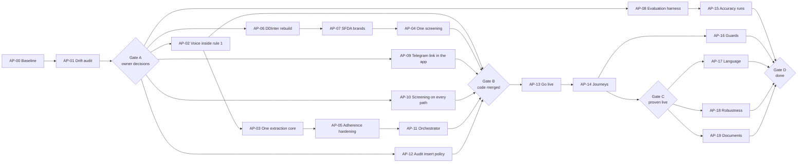

# Jur'ah (جرعة) · Agents Polish Plan

**What this is.** The plan, and the prompt that starts it, for polishing the whole AI-agents side of Jur'ah until the agents are fully functional: every spec agent built, wired to the live app, proven end to end and measured against its pass criteria.

**Who runs it.** **Mohammad**, from their own machine, in Claude Code with **Opus 5.5** (`claude-opus-5-5`). The n8n instance (`mohammad-aljry.app.n8n.cloud`) is Mohammad's, so the n8n connector lives in Mohammad's session. Every subagent the lead launches also runs on Opus (`model: "opus"`).

**Who else acts.**

| Person | Role in this plan | Acts through |
|---|---|---|
| **Mohammad** | Operator. Runs the lead session, owns every n8n step, the Telegram bot, the Alexa skill and the live smoke tests. | Claude Code (Opus 5.5) with the n8n, Supabase and Vercel connectors, `gh`, a phone with Telegram and the Echo |
| **Hamad** | Owner. Answers every decision in Gate A, pastes every Vercel secret, registers the bot's webhook, reviews and merges every pull request. | GitHub reviews, chat, the Vercel dashboard |
| **Waddah** | Drug knowledge. Supplies the DDInter build tools and rebuilt index, verifies SFDA brand names, reviews the screening and extraction changes. | GitHub, the DDInter build tools |

**Where it starts from.** Commit `d138b1a` on `main`, 2026-09-24. The study behind this plan is the artifact **Jur'ah Agents Study** (`https://claude.ai/artifact/QX25QGJ6zixBmbjhHUD7Y3`, shared inside the organization). Everything the plan needs from it is folded into the appendices, so this file stands alone.

---

## Contents

1. [Quick start for Mohammad](#1-quick-start-for-mohammad)
2. [The master prompt](#2-the-master-prompt)
3. [Baseline: where the agents stand](#3-baseline-where-the-agents-stand)
4. [Tools and connections](#4-tools-and-connections)
5. [Rules the lead and every subagent follow](#5-rules-the-lead-and-every-subagent-follow)
6. [Gate A: the owner's decisions](#6-gate-a-the-owners-decisions)
7. [Work packages](#7-work-packages)
8. [Gates and the verification standard](#8-gates-and-the-verification-standard)
9. [Inputs people owe the agents](#9-inputs-people-owe-the-agents)
10. [Definition of done](#10-definition-of-done)
11. [Appendix A: findings from the study](#appendix-a-findings-from-the-study)
12. [Appendix B: spec test-case coverage at the start](#appendix-b-spec-test-case-coverage-at-the-start)
13. [Appendix C: inventory](#appendix-c-inventory)

---

## 1. Quick start for Mohammad

1. **Get the code.** `git fetch origin && git checkout main && git pull`. Node 22 or later. `npm ci` at the root. The `agents/` and `agents/knowledge/` packages have no dependencies.
2. **Get the environment.** Ask Hamad for a `.env.local` (database URL for a test branch, agent token, inbound secret). Never commit it, never paste its values into chat, never let the agent print them.
3. **Open Claude Code on the repository root** (desktop app or CLI). Pick **Opus 5.5** in the model picker and set effort to high.
4. **Connect the connectors** (claude.ai → Settings → Connectors, then check in the session):
   - **n8n** (install it; it is not connected by default) and authorise it against `mohammad-aljry.app.n8n.cloud`.
   - **Supabase**, with access to project `frvubflbpujwuhsxweue`.
   - **Vercel**, with access to the project that serves `tryjuraaah.vercel.app`.
   - **GitHub** through the `gh` CLI: `gh auth status` must show you logged in with push access to `Hamad-Almesri-Coded-Bootcamp/try-Juraah-Hamad`.
5. **Paste the master prompt** from section 2, filling in `RUN MODE`. Start with `RUN MODE: GATE A` so the owner's decisions and the baseline come first.
6. **Keep this file open.** The lead reads it in full and treats sections 5 to 10 as binding.

---

## 2. The master prompt

Paste everything inside the block. Change only the three lines under `RUN`.

```
RUN
  RUN MODE: GATE A            (one of: GATE A · AP-NN · GATE B · GATE C · GATE D · ALL)
  OPERATOR: Mohammad
  BRANCH PREFIX: polish/

ROLE: YOU ARE THE LEAD FOR THE JUR'AH AGENTS POLISH

You are Claude Opus 5.5, running in Claude Code on Mohammad's machine. You plan, decompose,
delegate, review and integrate the polish of Jur'ah's AI agents, described in
docs/AGENTS-POLISH-PLAN.md. Implementation goes to subagents you launch with the Agent tool,
model "opus", each from a written brief. Independent briefs launch in parallel, in one message,
each with isolation "worktree" so they never share a working tree. You write code yourself only
to resolve a conflict between two subagents' work, or for a fix under ten lines found in your own
review.

READ FIRST, in this order, before you plan anything
1. CLAUDE.md: the nine rules. They bind every agent and every workflow.
2. docs/AGENTS-POLISH-PLAN.md, all of it. Sections 5 to 10 are binding.
3. docs/AI Agents Acceptance Criteria.md: the binding specification for the agents. Every test
   case, pass criterion and non-negotiable invariant is a hard requirement.
4. docs/Project Brief.md: the agent architecture, the core safety principle, why Telegram.
5. agents/README.md and agents/knowledge/README.md: how the workflows are generated and deployed.
6. docs/DECISIONS.md: every entry from CR-062 on, plus D-015 to D-041. CR-069 and CR-070 each
   exist twice (a UX entry and an agents entry): cite them by heading, never by number alone.
7. docs/Seed Dataset.md: the only test fixture. You never invent patients, drugs or citations.
8. docs/API-SURFACE.md section B, docs/SCHEMA.md, docs/ENFORCEMENT.md: the agent routes, tables
   and enforcement rows the agents rely on.

WHAT YOU DO FOR THE RUN MODE
- GATE A: run AP-00 and AP-01, then write the decision sheet of section 6 as a pull request
  that adds the decisions to docs/DECISIONS.md, and STOP until Hamad answers in that PR.
- AP-NN: do exactly that work package, on its own branch, and stop at its acceptance.
- GATE B: run AP-02 to AP-12 in the lane order of section 7.2, lanes in parallel, packages
  inside a lane one after another, and stop at Gate B.
- GATE C: run AP-13, then AP-14, and stop at Gate C.
- GATE D: run AP-15 to AP-19 and stop at Gate D.
- ALL: GATE A, B, C and D in that order, stopping at each gate until Hamad passes it.

HOW YOU WORK
- One work package, one branch named BRANCH PREFIX + "ap-NN-<slug>", one pull request to main.
  Never push to main. Hamad reviews and merges.
- The repository is the source of truth for every n8n workflow. Change the generator
  (agents/scripts/build.js, agents/knowledge/scripts/build.js, the lib and src modules), rebuild,
  and only then publish to n8n. Never edit a node in the n8n editor without porting the same
  change to the generator in the same pull request. The drift check (AP-01) must read zero at
  every gate.
- Before any change to the live n8n instance, export the workflow as it is (n8n connector) into
  the pull request's notes, say in chat exactly what will change, and wait for Mohammad to say
  yes. Publishing, unpublishing and executing live workflows are outward actions.
- Anything that needs a secret, a phone, the Echo, the n8n credential screen, BotFather,
  the Alexa console or the SFDA register is a human step. Write the exact step, name who does it
  (section 1 table), and wait.
- Anything that changes a data contract, an invariant, a screen's scope, the role model, a seed
  value or a UX rule is a change request: write it in the work package's notes file
  (docs/backend-notes/ap-NN.md) with what the document says, why it is a problem, what you
  propose, what it costs and what breaks if we do not, then continue as written until Hamad
  answers. New DECISIONS entries start at CR-073 and D-042; the lead assigns the numbers when it
  merges the notes at a gate, so parallel branches never collide.
- Never self-certify. Every acceptance item is a command and its pasted output, or a connector
  call and its pasted result.

REPORT BACK after every work package
Objective · branch and pull request link · files changed · every acceptance command with its
output · live changes made (before and after exports) · change requests raised · human steps
still open, with who owes them · what you could not prove and why.
```

---

## 3. Baseline: where the agents stand

Numbers from commands run on `d138b1a`; the lead re-runs them in AP-00 and pastes its own.

| Measure | Value at the start |
|---|---|
| n8n workflows in the repository | 8 (131 nodes): 5 in `agents/workflows/`, 3 in `agents/knowledge/workflows/` |
| Agent tests passing | 74 (`agents`, `npm test`) · 65 (`agents/knowledge`, `npm test`) · 129 (root, `npx vitest run tests/unit/agent`) |
| Workflow checks | `npm run check` passes in both agent packages |
| Seed drug ingredients the DDInter index covers | 2 of 9 (Levothyroxine, Calcium carbonate; `npm run coverage` in `agents/knowledge`) |
| End-to-end runs recorded in `docs/VERIFICATION.md` | 0 |
| Data-based accuracy targets measured | 0 of 5 |
| Spec test cases (68) | 26 tested · 3 built, untested · 15 held by the backend · 15 partial · 9 missing (Appendix B) |
| `[TO BE SUPPLIED]` markers in `agents/` | 5 |

**The short verdict.** The agents are carefully built and wired: the model only classifies or reads, fixed code makes every decision, and every write goes through the guarded `/api/agent/**` routes. Nothing is proven end to end, nothing is measured, and four problems stand in front of a working product:

1. **Voice can record dose statuses on the live demo.** The agents entry CR-070 in DECISIONS records `VOICE_RECORDS` as on in the live `agent-alexa` node and off in the repository. That breaks rule 1 and TC-AD-14/15.
2. **No patient can link Telegram from the app.** No `t.me/<bot>?start=<token>` link exists anywhere in the app, so the adherence loop cannot start for anyone outside the seed.
3. **The DDInter index misses Warfarin × Ibuprofen,** the demo's headline danger.
4. **Screening fires from one place only,** after the save, best effort; reviewer-confirmed prescriptions are never screened.

---

## 4. Tools and connections

Check them at the start of every session with `session_connectors_status` and list the n8n tool names you actually see; the names below were read from the connector registry and may differ slightly.

| Tool | Use it for | Never use it for |
|---|---|---|
| **n8n connector** (`search_workflows`, `get_workflow_details`, `execute_workflow`, `get_execution`, `search_executions`, `publish_workflow`, `unpublish_workflow`, `prepare_test_pin_data`, and more) | Listing and exporting the Jur'ah workflows, the drift check, reading executions as proof, publishing a rebuilt workflow after Mohammad's yes | Editing node code in place, creating credentials, reading credential values |
| **Fallback if the n8n connector is missing** | The REST calls in `agents/README.md` step 5 (`POST /rest/workflows/<id>/activate {versionId}`), run by Mohammad | Anything the connector would do silently |
| **Supabase connector** (project `frvubflbpujwuhsxweue`) | `list_tables`, read-only `execute_sql` for proofs (audit rows, dose statuses, links), `get_advisors`, `query_logs`; `create_branch` for a test database only after `get_cost`, `confirm_cost` and Hamad's yes | Writing to the production database outside a recorded journey, applying a migration to production without Hamad's yes |
| **Vercel connector** (the project behind `tryjuraaah.vercel.app`) | `list_deployments`, `get_deployment`, `get_runtime_logs`, `get_runtime_errors`, checking that an environment variable **exists** with `filter_project_envs` | Reading a secret's value, creating or editing an environment variable (Hamad does that), promoting or rolling back a deployment without Hamad |
| **GitHub** (`gh` CLI) | Branches, pull requests, one issue per work package if Hamad wants them, reading CI | Pushing to `main`, merging, force-pushing |
| **Built-in browser** | Checking app screens on a local server (`.claude/launch.json`: `next-dev-3100` real backend, `next-dev-mock-3100` mock) and on production, screenshots for the journeys | Signing in with real credentials, anything on a claude.ai page |
| **scheduled-tasks** | Optional: a daily drift check once AP-01's script exists | Anything that writes |
| **Humans** | Secrets, BotFather, `setWebhook`, the n8n credential screen, the phone, the Echo, the Alexa console, SFDA verification, the datasets in section 9 | |

**Access comes before the run.** The Vercel team and the Supabase project are Hamad's. Hamad adds Mohammad to both before Gate A, or else every Vercel and Supabase check in this plan becomes Hamad's step: Hamad runs it and pastes the result into the pull request.

**The environment variables the agents need.** Names only; Hamad pastes every value in Vercel, Mohammad binds every credential in n8n.

| Name | Where | What it is |
|---|---|---|
| `JURAH_AGENT_TOKEN` | Vercel | The bearer n8n sends to `/api/agent/**` |
| `JURAH_AGENT_INBOUND_SECRET` | Vercel and n8n | The `x-jurah-secret` header on every webhook |
| `JURAH_AGENT_INBOUND_URL` | Vercel | `…/webhook/jurah/telegram-inbound` |
| `JURAH_AGENT_CHAT_URL` | Vercel | `…/webhook/jurah/webchat` |
| `JURAH_AGENT_TRAVEL_CHECK_URL`, `JURAH_AGENT_EXTRACTION_URL`, `JURAH_AGENT_SCREENING_URL` | Vercel | The three drug-knowledge webhooks (CR-066) |
| `JURAH_BOT_TOKEN` | Vercel and n8n | The Telegram bot; the app derives its webhook path from it |
| `NEXT_PUBLIC_BOT_HANDLE` | Vercel | The real bot handle (owed, section 9) |
| Gemini credential | n8n | Used by 5 of the 8 workflows |
| `GEMINI_API_KEY` | Mohammad's shell only | The evaluation harness in AP-08 and AP-15 |
| `N8N_API_KEY` | Mohammad's shell only | The drift script's fallback when the connector is not there |

---

## 5. Rules the lead and every subagent follow

**The nine rules in `CLAUDE.md` come first.** The ones the agents touch most:

- **Rule 1.** No button, notification action, **voice command** or web-assistant message may create or change `Dose.status`. A dose status comes only from the patient's own Telegram chat, through the adherence path.
- **Rule 3 and rule 4.** A dose with `tracked: false` is never given a status. Silence is never `missed`.
- **Rule 5.** A caregiver whose invitation is not `active` gets nothing, and nothing from them is accepted.
- **Rule 6 and rule 7.** No Civil ID, chat id, link token or push endpoint reaches a screen or a message.
- **Rule 9.** `kuwaitNow()` / `kuwaitToday()` drive every time comparison in the app.

**The agent spec's invariants.**

- The model classifies, reads or transcribes. Code decides severity, review state, which dose, every date and every word the patient reads.
- Extraction never auto-commits a record whose strength, frequency, dispense date, start date or dose times are unsure: it flags `needsReview: true`.
- No agent writes `reviewStatus: "reviewed"`, any reviewer field or any `fieldReview*` field.
- No prescription, refill or travel-check result reaches the patient without passing through screening.
- A pass criterion that is not met is reported as failing. **Never lower a threshold.**
- A test case marked "requires human-supplied input" stops and asks. **Never fabricate the data.**

**The owner's standing rules.**

- **Never self-certify.** Paste the command and its output.
- **A guard that passes because its input is missing is worse than no guard.** Every check fails loudly the moment its input should exist and does not.
- **Rules stated in the seed or the spec become asserted invariants,** with a unit test, not prose.
- **Every static guard gets one runtime proof beside it** (for example: a static check that `agent-alexa` has no dose-write node, plus a live "mark it taken" that leaves no audit row).
- **When a suite fails broadly, debug two or three failures first,** compare against the last good commit, rerun only the failed tests on a fresh server, and only then run the full suite.
- **Owed values get the loud marker `[TO BE SUPPLIED]`,** never a plausible invented value. Guard P counts them at every gate.
- **Never edit `docs/wireframes/` or `docs/design-system/`.** A screen the boards do not show is a change request, not a build.
- **App copy is Fusha Arabic, human-sounding, with no em dashes, and each locale shows only its own language.** This covers every agent reply the app displays (the assistant panel, the voice panel). The register the agents use in Telegram and on Alexa is the owner's decision (section 6, D7).
- **Secrets are the owner's.** No agent types, prints, commits or decrypts one.
- **Do not commit on `main`, do not merge, do not push to `main`.** Branch, pull request, Hamad merges.

**The live-instance protocol.**

- One live n8n instance serves the demo. Only the lead session changes it, and only after Mohammad's yes in chat.
- Before any publish: export the current workflow (n8n connector) into `docs/backend-notes/ap-NN.md`. After it: export again and show the diff.
- Never have two workflows on one webhook path. Unpublish the old one first (the legacy screening and the DDInter screening share `jurah/screen-prescription`).
- The production database is read-only for the lead, except during a recorded journey (AP-14) on the patients Hamad approves in D8.

---

## 6. Gate A: the owner's decisions

The lead writes these into a pull request that appends them to `docs/DECISIONS.md` as CR-073 onward, then stops. **If Hamad has not answered, the lead takes the "default if unanswered" and says so; that default is always the specification as written.**

| Id | Question | Recommended | Default if unanswered | Blocks |
|---|---|---|---|---|
| **D1** | Voice dose recording (agents CR-070): turn `VOICE_RECORDS` off in the live node and remove the write path, or amend rule 1 and TC-AD-14/15 first? | Off, and remove the write nodes | Off (rule 1 as written). The live flip still waits for Mohammad's yes | AP-02 |
| **D2** | Which Interaction Screening survives: the DDInter workflow (`agents/knowledge`) or the legacy one (`agents/lib/screening.js`)? | DDInter: stricter on every point checked, fails loudly | Both stay; no retirement | AP-04 |
| **D3** | Which Extraction core survives for both Telegram and the app? | The drug-knowledge core (`agents/knowledge/src/extraction.js`) in both paths | Both stay; only the unit bug is fixed in the Telegram copy | AP-03 |
| **D4** | CR-068: may the web assistant record "I took it"? | No. Keep rule 1; the assistant sends buttons to Telegram | No | none |
| **D5** | TC-IX-02: a clean screen raises one `info` `auto_cleared` alert today; the spec says no alert. Keep the alert as the "screened" marker, or follow the spec? | Keep it, logged as a deliberate reading, because AP-10 needs a "screened" marker | Follow the spec: no alert | AP-10 |
| **D6** | CR-066: the app has no "cannot verify" outcome for a drug photo (it shows "could not identify"). Add one to the contract? | Add `cannot_verify` to `DrugCheckOutcome` with its own copy | Keep the mapping | AP-11 |
| **D7** | Register of agent replies in Telegram and on Alexa: Kuwaiti dialect (today) or Fusha like the app? | Fusha in text the app shows; Hamad's call for Telegram and voice | As today (dialect in chat and voice) | AP-17 |
| **D8** | Where do live tests write? A Supabase branch plus a Vercel preview (costs money), production with the two demo patients from D-041, or production with seed patient pt-03? | A Supabase branch for integration runs; production demo patients for the journeys, reset afterwards | No live writes at all | AP-13, AP-14 |
| **D9** | D-035: may an agent overwrite a recorded status, or is a status one-shot? | Keep overwrite (each write is audited) | Keep overwrite | AP-05 |
| **D10** | What does "a refill passes through screening" mean? | Re-screen the prescription's pairs when a refill is requested | Re-screen on refill request | AP-10 |
| **D11** | The Telegram link token: put it only in a server redirect (`303` to `t.me`), so it never appears in the page? | Yes | Yes (rule 7 as written; the e2e test that scans the page for the token keeps passing) | AP-09 |
| **D12** | A "being checked" state on a new prescription until screening answers: approve a board for it? | Yes, Hamad draws or approves the board first | Not built | AP-10 |
| **D13** | The real bot handle, and who registers the app as the bot's webhook | Hamad supplies the handle and runs `setWebhook` | `[TO BE SUPPLIED]` stays; linking stays simulated | AP-09, AP-13 |

---

## 7. Work packages

### 7.1 The map



### 7.2 Lanes and collisions

Several packages edit the same generator. **Packages that share a file run one after another, in the order listed; packages that share nothing run in parallel.**

| Lane | Packages, in order | Shared files |
|---|---|---|
| Telegram workflow | AP-02 → AP-03 → AP-05 → AP-11 | `agents/scripts/build.js`, `agents/scripts/check.js`, `agents/lib/*.js` |
| Drug knowledge | AP-06 → AP-07 → AP-04 | `agents/knowledge/**` (AP-04 also removes the legacy screening from `agents/scripts/build.js`, so it waits for the Telegram lane's current package to merge) |
| App and backend | AP-09, AP-10, AP-12 in parallel | `features/ambient/**`, `lib/data/pg/**`, `supabase/migrations/**` (disjoint) |
| Evaluation | AP-08 | `agents/eval/**` (new) |

### 7.3 The packages

Each package lists: **why** (the finding it closes), **touches** (files it may change), **must not touch**, **steps**, **tools**, **acceptance** (commands and outputs to paste), and **human steps**.

---

#### AP-00 · Baseline

- **Why.** Every later claim is measured against this.
- **Touches.** `docs/backend-notes/ap-00.md` only.
- **Steps.** Check the connectors; run the commands below; record the numbers against section 3; list the Jur'ah workflows the n8n connector sees (names, active state, last update).
- **Acceptance.**
  ```
  cd agents && npm test && npm run check
  cd agents/knowledge && npm test && npm run check && npm run coverage
  npx vitest run tests/unit/agent tests/unit/agent-webhooks tests/unit/assistant
  npm run verify
  grep -rhoE 'TO BE SUPPLIED|TO_BE_SUPPLIED' agents | wc -l
  ```
  plus the n8n workflow list, pasted.

#### AP-01 · Live drift audit and the drift check

- **Why.** The live `agent-alexa` node differs from the repository (`VOICE_RECORDS`), and fixes were made to live nodes directly (commit `01a67d1`). Nobody can reason about the system while the live instance and the repository disagree.
- **Touches.** `agents/scripts/drift.js` (new), `agents/package.json` (a `drift` script), `docs/backend-notes/ap-01.md`.
- **Steps.**
  1. Export every live Jur'ah workflow with the n8n connector (`get_workflow_details`).
  2. Write `drift.js`: normalise both sides (drop ids, positions, credential ids, `versionId`, timestamps; keep node names, types, parameters and Code-node source) and print a per-node diff against the committed JSON. It reads the live side from files the lead saved, or from the n8n API with `N8N_API_KEY` when run by hand. It **fails** when a committed workflow has no live counterpart and when a live Jur'ah workflow has no committed file.
  3. Treat the live-only values as expected, named differences: `ALEXA_SKILL_ID` and `ALEXA_LINKS` in `alexa request (deterministic)` are set only in the live node and ship empty in the repository on purpose. The script reports them as "live-only config", never prints their values and never copies them into the repository.
  4. Propose moving those two values out of the node code into n8n Variables (`$vars`) or a credential, read with an empty fallback, so a rebuilt workflow can be published without wiping them. Until that lands, every publish of `agent-alexa` includes a step where Mohammad re-enters them.
  5. Report every other difference. Do not fix anything live in this package.
- **Tools.** n8n connector (read only).
- **Acceptance.** The drift report pasted, with `VOICE_RECORDS` expected among the differences; the script run once against a deliberately edited copy to show it goes red.

---

#### AP-02 · Voice back inside rule 1

- **Why.** Finding 1. Alexa can record doses on the live demo.
- **Depends.** D1.
- **Touches.** `agents/scripts/build.js` (the `agent-alexa` section), `agents/lib/voice-actions.js`, `agents/test/voice-actions.test.js`, `agents/scripts/check.js`, `agents/workflows/agent-alexa.json` (rebuilt), `agents/README.md` (voice section).
- **Must not touch.** `agents/lib/voice.js` read paths, the app.
- **Steps.**
  1. With D1 "off and remove": delete the write branch (`record now?`, `one item per write`, `backend: record the status`, the recompute nodes) and the `VOICE_RECORDS` switch. A record request is answered with the fixed "I can't record by voice; I've sent the buttons to your Telegram" text, and the buttons are sent.
  2. `check.js` asserts `agent-alexa` makes exactly two GETs and the one voice-turn POST, and no call to `/doses/` or `/schedule/`.
  3. Rebuild, verify, open the pull request.
  4. After Hamad merges: export the live `agent-alexa`, show Mohammad the diff, publish on Mohammad's yes, have Mohammad restore the skill id and device link if AP-01's move to n8n Variables has not landed, export again, run the drift check.
- **Tools.** n8n connector (export, publish), the Echo (Mohammad).
- **Acceptance.** `npm run verify` in `agents`; the static assertion; **the runtime proof**: Mohammad says "mark my medicine as taken" to the Echo, and this query returns no new row:
  ```sql
  select id, actor_role, created_at from audit_events
  where type = 'dose_status_recorded' and created_at > now() - interval '10 minutes';
  ```

#### AP-03 · One extraction core

- **Why.** Two extractions with different rules. The Telegram copy keeps a strength without its unit (the backend then assumes mg, so 50 mcg Eltroxin becomes 50 mg), skips the `finishReason` check, and calls a Gemini outage "not a prescription".
- **Depends.** D3. Runs after AP-02 in the Telegram lane.
- **Touches.** `agents/scripts/build.js` (extraction branch of `agent-telegram-inbound`), `agents/lib/extraction.js` (removed or reduced to a re-export), `agents/test/extraction.test.js`, `agents/knowledge/src/extraction.js` (only to add the caption input), `agents/knowledge/test/extraction.test.js`, the rebuilt workflows.
- **Steps.**
  1. Inline `agents/knowledge/src/extraction.js` into the Telegram extraction Code nodes, the way `agents/knowledge/scripts/build.js` already does.
  2. Keep the Telegram-only parts: the caption (context only; a caption that contradicts the image sets `needsReview`, closing TC-EX-06), the 15 MB limit, the Telegram reply.
  3. A model error or a truncated answer is `unreadable` with the reason named, never `not_a_prescription`.
  4. A saved, unflagged prescription whose screening hand-off fails ends in Stop and Error, as the app path already does. (If AP-10 moves the screening trigger into the backend, this hand-off goes away; coordinate.)
- **Acceptance.** Tests for: a strength with no unit is flagged; a truncated answer is not parsed; an outage is not "not a prescription"; a contradicting caption flags `needsReview`. `npm run verify` in both packages; `npx vitest run tests/unit/agent/agents-contract.test.ts tests/unit/agent/knowledge-contract.test.ts`.

#### AP-04 · One screening

- **Why.** Two screenings share one webhook path with different policies, and the legacy one cites `[TO BE SUPPLIED]` and fails silently.
- **Depends.** D2, AP-06 (the rebuilt index must cover the seed before the legacy one goes), AP-07.
- **Touches.** `agents/lib/screening.js` and `agents/test/screening.test.js` (removed), the legacy section of `agents/scripts/build.js` and `agents/scripts/check.js`, `agents/workflows/agent-interaction-screening.json` (removed), `agents/README.md`, `agents/knowledge/**` as needed.
- **Steps.** Remove the legacy screening from the generator and the repository; make the DDInter workflow the only one on `jurah/screen-prescription`; set an n8n error workflow for it (AP-18 builds the error workflow). Live: unpublish the legacy workflow, then publish the DDInter one, on Mohammad's yes.
- **Acceptance.** `npm run verify` in both packages; `npm run coverage` showing the rebuilt index; the n8n workflow list showing exactly one workflow on the path; the drift check at zero; the `[TO BE SUPPLIED]` count in `agents/` going down by the legacy markers.

#### AP-05 · Adherence hardening

- **Why.** Gaps in TC-AD-08, TC-AD-12, TC-AD-16 and the discontinuation path.
- **Depends.** D9. Runs after AP-03 in the Telegram lane.
- **Touches.** `agents/lib/adherence.js`, `agents/test/adherence.test.js`, the adherence sections of `agents/scripts/build.js` and `agents/scripts/check.js`, the rebuilt workflows.
- **Steps.**
  1. **Discontinuation confirms the medicine.** "The doctor told me to stop it" never writes directly. The agent answers with one button per open prescription ("Stop <drug>?") and a "none of these" button; only a tap discontinues. Keep callback data under Telegram's 64 bytes.
  2. **Replies across midnight.** A reply between 00:00 and 03:00 Kuwait time also reads the previous day's open doses (`previousDate()` exists and is unused). One candidate: use it. More than one, across both days: ask which. Never attach to the wrong day (TC-AD-12).
  3. **Logs.** A skipped patient in the daily run, a message from a non-active caregiver that somehow arrives, and a failed Telegram send each produce one log item in the n8n execution (a named Code node output), and a failed send also goes to the error workflow (AP-18).
  4. **Tracking off.** If the backend tells the relay that tracking is off (a change request to CR-063's payload, raised here), the reply says check-ins are not switched on, instead of "no dose".
- **Acceptance.** One test per step, titled by its test-case id; `npm run verify`; `npm run check` scenarios for each.

---

#### AP-06 · DDInter rebuild with the seed scope

- **Why.** Finding 3. The index covers 2 of 9 seed ingredients; the demo's Warfarin × Ibuprofen is not in it.
- **Blocked on Waddah.** The build tools the data refers to (`tools/build-brand-index.js`, `tools/build-demo-index.js`, `data/build/interaction-index.json`) are **not in the repository**. The lead asks Waddah to commit them under `agents/knowledge/tools/` or to run them and commit the output. **The lead never writes an interaction row by hand.**
- **Touches.** `agents/knowledge/tools/**` (new), `agents/knowledge/data/interaction-index.json`, `agents/knowledge/data/seed-drug-scope.json`, `agents/knowledge/test/**`.
- **Steps.** Add every seed ingredient from `data/seed-drug-scope.json` to the build scope; rebuild; commit; update the tests that assumed "cannot verify" for pt-01.
- **The citation.** DDInter will cite Warfarin × Ibuprofen as the DDInter paper plus both DDInter ids and the level. That text is **proposed to Hamad** as the real `sourceCitation` for the seed's `ia-001`; the seed itself is not edited without Hamad's yes (it is an owed value, Hamad's to give).
- **Acceptance.** `npm run coverage` showing each seed ingredient covered, or listed as absent from DDInter with the reason; a screening test where pt-01's Ibuprofen raises `danger`, `pending_medical_review`, with the DDInter citation; `npm run verify`.

#### AP-07 · SFDA brand verification

- **Why.** The seed's brands (MAREVAN, BRUFEN, GLUCOPHAGE, LIPITOR) are unverified or missing from the brand map, so Travel Check cannot resolve them.
- **Human step.** Waddah (or Hamad) confirms each trade name against the SFDA public register. The lead may open the register in the browser and put the evidence (a screenshot and the exact registered name) in the pull request, but sets `verified: true` only after Waddah approves that pull request.
- **Touches.** `agents/knowledge/data/brand-map.json`, `agents/knowledge/test/travel-check.test.js`.
- **Acceptance.** Tests resolving each approved brand to its ingredient; `npm run verify`.

#### AP-08 · Evaluation harness

- **Why.** Every test stubs the model. None of the five data-based thresholds is measured.
- **Touches.** `agents/eval/**` (new), and moving the prompt strings that live inside `agents/scripts/build.js` (adherence classification, web chat, voice free talk) into the lib modules, so the workflow and the evaluation use one string.
- **Steps.**
  1. `agents/eval/datasets/` with one schema file and one empty data file per set in section 9, and a README saying who supplies each.
  2. `agents/eval/run.js`: sends each item through the exact prompt and schema the workflow uses, with `GEMINI_API_KEY` from the shell, and scores it against the spec threshold (extraction: field-level accuracy on core fields; adherence: intent accuracy; screening: recall on the known set; travel: identification; routing: correct route).
  3. **No dataset, or fewer items than the spec's minimum, is a failure** printed as `NOT MEASURED: <set> has <n> of <min> items`, with exit code 1. Never a pass.
  4. Thresholds live in one constant copied from the spec, with a test that fails if any differs from `docs/AI Agents Acceptance Criteria.md`.
- **Acceptance.** The runner going red on the empty sets (pasted), and going green on a one-item smoke file in a temporary folder that is not committed.

---

#### AP-09 · Telegram linking from the app

- **Why.** Finding 2. "Open Telegram" creates a pending token that never reaches Telegram.
- **Depends.** D11, D13.
- **Touches.** A new route handler (for example `app/[locale]/app/more/notifications/telegram/route.ts`) that mints the link and answers `303` to `https://t.me/<handle>?start=<token>`; `features/ambient/NotificationsScreen.tsx`, `features/identity/SetupFlow.tsx`, `features/caregiving/CaregiverProfile.tsx` (the button becomes a form that posts to that route and opens Telegram); the pending poll; `i18n/copy/*` for any new line; `tests/e2e/ambient.spec.ts`, `tests/e2e/identity.spec.ts`.
- **Must not touch.** The link-token rules in `lib/data/pg/channels.ts` (single use, 15 minutes), the boards.
- **Steps.**
  1. The token appears only in the redirect's `Location` header. The existing e2e assertion that the page never contains the token keeps passing.
  2. The handle comes from `lib/config.ts`. Until Hamad supplies it, the flow stays simulated and says so, exactly as today.
  3. The pending state polls for minutes, not 12 seconds, and offers "I pressed Start" to check again.
  4. The caregiver's link works only while the invitation is `active` (already enforced by the backend; add the e2e).
  5. Fusha copy, no em dashes, the UX Principles checklist on every screen touched.
- **Tools.** Browser (local, `next-dev-3100`), then Mohammad's phone in AP-14.
- **Acceptance.** `npm run verify`; the e2e specs above, pasted; a screenshot of the pending state; the `Location` header of the route's answer in a local run with a test token.

#### AP-10 · Screening on every path

- **Why.** Finding 4. Screening runs only from `savePrescriptionDraft` (`lib/data/pg/reads-rx.ts`), fire and forget, after the prescription is visible.
- **Depends.** D5, D10, D12.
- **Touches.** `lib/data/pg/writes.ts` (`confirmPrescriptionFields`, `requestRefill`), `lib/data/pg/agent.ts` (`POST /api/agent/prescriptions`), `lib/agent-webhooks/**`, `tests/unit/agent-webhooks/**`, `tests/integration/roundtrip/agent-webhooks.test.ts`.
- **Steps.**
  1. The backend calls `requestScreening` after: an unflagged prescription saved by the app, an unflagged prescription saved by an agent route, a reviewer's field confirmation, and a refill request (D10). Then the n8n extraction workflows stop calling the screening webhook themselves, so no prescription is screened twice (coordinate with AP-03).
  2. A screening request that n8n does not accept is not lost: raise a change request for a small retry record (a table or a job), and until it is approved, log the miss where Hamad can see it.
  3. The "being checked" state is built only if D12 approves a board.
- **Acceptance.** Unit tests for each trigger; the integration round trip on a Supabase branch (D8); a static guard (AP-16) that every function creating or confirming a prescription calls `requestScreening`.

#### AP-11 · A real Orchestrator, and Travel Check from Telegram

- **Why.** There is no Orchestrator: every Telegram photo goes to extraction, so a medicine box is declined as "not a prescription", and Travel Check is reachable only from the app.
- **Depends.** AP-03, AP-05, D6.
- **Touches.** `agents/scripts/build.js` (the `route` node and a new photo branch), a new `agents/lib/orchestrator.js` with its tests, `agents/scripts/check.js`.
- **Steps.**
  1. A photo from a patient first gets one narrow vision question: `prescription`, `medicine_package`, `other` or `unsure`, with a confidence; below 0.7 counts as `unsure`.
  2. `prescription` goes to extraction; `medicine_package` downloads the image and calls `jurah/travel-check`, then replies from the fixed travel text; `other` gets a short explanation; `unsure` asks with two buttons ("a prescription" or "a medicine box"). Keep callback data under 64 bytes: key the pending photo by the message id, not the file id.
  3. A caregiver's photo goes nowhere clinical: a short reply, nothing saved.
  4. The routing test set (section 9) carries at least three box-or-prescription confusions and one caregiver message.
- **Acceptance.** Tests per route; `npm run check` scenarios; routing accuracy reported by AP-15 when the set exists.

#### AP-12 · The audit insert policy (CR-061)

- **Why.** The audit log is the product's proof that no dose status came from the interface, and today its insert policy would accept `actor_role = 'agent'` from a patient session.
- **Touches.** `supabase/migrations/0014_*.sql` (new; never edit an earlier migration), `supabase/README.md`, `tests/integration/enforcement/*.test.ts`.
- **Steps.** Restrict inserts naming the agent actor to the `jurah_agent` role; apply it to a Supabase branch first; apply to production only on Hamad's yes.
- **Acceptance.** An enforcement test that a patient session inserting an agent-actor row is refused; the Supabase `get_advisors` output before and after.

---

#### AP-13 · Go live

- **Why.** Nothing the polish builds counts until it runs.
- **Depends.** Gate B, D8, D13.
- **Human steps, in order.**
  1. **Hamad** sets the Vercel variables of section 4 and redeploys. The lead checks each one **exists** with the Vercel connector and never reads a value.
  2. **Mohammad** binds the n8n credentials (agent bearer, inbound secret, Telegram, Gemini) on every node that needs them, as `agents/README.md` lists.
  3. **Mohammad**, through the lead: unpublish the retired workflows, publish the rebuilt ones, read back every webhook URL (`/webhook/`, never `/webhook-test/`).
  4. **Hamad** registers the app as the bot's only webhook with `setWebhook`, as `agents/README.md` step 6 describes.
  5. The lead runs the drift check (must read zero) and the smoke test in `agents/knowledge/README.md` step 6.
- **Acceptance.** The Vercel variable presence list; the n8n workflow list with active states; the drift output; the smoke execution read back with `get_execution`.

#### AP-14 · End-to-end journeys

- **Why.** Zero end-to-end runs are recorded. The demo depends on these.
- **Depends.** AP-13.
- **Touches.** `docs/VERIFICATION.md` (a new "Agents, live" section), `docs/backend-notes/ap-14.md`.
- **For each journey, record:** who did what, the n8n execution (`get_execution`, status and the decision node's output), the database rows it produced (Supabase `execute_sql`, read only), and a screenshot of the screen that shows the result. Reset the test patients afterwards by the procedure Hamad approved in D8.

| Id | Journey | Who acts | Proof |
|---|---|---|---|
| J1 | A patient links Telegram from the app | Mohammad (phone) | `messaging_links` row `connected`; `messaging_connected` audit row |
| J2 | The daily check-in arrives; a tap records "taken on time" | Lead triggers `jurah/checkin-now`; Mohammad taps | `doses.status`, `source = adherence_agent`; audit row with actor `agent`; Today shows it |
| J3 | A typed dialect reply is understood, or asked about | Mohammad | Execution shows intent and confidence; a status only when trusted |
| J4 | A reported miss recomputes the schedule | Mohammad | `missed` status and a `schedule_recomputed` row; the missed dose still listed |
| J5 | "The doctor stopped it" asks which medicine, then discontinues | Mohammad | Buttons first, then `prescription_discontinued` |
| J6 | An active caregiver writes "أبوي خذ الدوا" | Mohammad (second account) | Refusal reply; no new status |
| J7 | A chat that belongs to no active person writes in | Mohammad | Nothing relayed, nothing sent |
| J8 | A prescription photo added in the app | Mohammad (browser) | Extraction result; saved record; screening execution; an alert pending review in the reviewer's queue |
| J9 | A prescription photo sent on Telegram | Mohammad | The same, from the chat |
| J10 | A medicine box sent on Telegram | Mohammad | Travel-check reply; a danger alert pending review when it applies |
| J11 | The web assistant: "my next dose", then "I took it" | Mohammad (browser) | The right screen opens; buttons arrive in Telegram; no status written |
| J12 | Alexa: "my next dose", then "mark it taken" | Mohammad (Echo) | Spoken answer; refusal; no `dose_status_recorded` row (AP-02's runtime proof) |
| J13 | The reviewer confirms a flagged prescription | Hamad (reviewer seat) | A screening execution follows the confirmation (AP-10) |

**The closing proof,** the demo's own moment, run before and after the journeys:

```sql
select actor_role, count(*) from audit_events
where type = 'dose_status_recorded' group by 1;
```

Only `agent` and `system` may appear.

#### AP-15 · Accuracy runs

- **Depends.** AP-08 and the datasets in section 9.
- **Steps.** Run `agents/eval/run.js` on every set; record the numbers in `docs/VERIFICATION.md`, one row per threshold: the set size, the score, the threshold, pass or fail. A set still short of its minimum is recorded as `NOT MEASURED`.
- **Acceptance.** The pasted output. **No threshold is adjusted, and no failing number is rounded into a pass.**

#### AP-16 · Guards

- **Why.** The owner's rule: every static guard gets one runtime proof.
- **Touches.** `scripts/guards/**`, `agents/scripts/check.js`.

| Guard | Static check | Runtime proof |
|---|---|---|
| No voice dose write | `agent-alexa` has no call to `/doses/` or `/schedule/` | J12 |
| Screening on every path | Every function that creates or confirms a prescription calls `requestScreening` | J8, J13 |
| No drift | `npm run drift` reads zero | AP-13 read-back |
| No token on a screen | The existing page scan, extended to the new route's pages | J1 |
| Guard P | Count `[TO BE SUPPLIED]` in `agents/` and the app, and list each | Printed at every gate |

---

#### AP-17 · Language

- **Why.** The app speaks Fusha; the agents reply in dialect; agent-written Arabic alert text appears in the English app; `agents/lib/webchat.js` contains em dashes.
- **Depends.** D7.
- **Steps.** Every agent string the app displays (web chat replies, voice panel lines) follows the app's language rules. Telegram and voice follow D7. Remove every em dash from agent strings. Add English alert descriptions on the agent side when the patient's language is English, and raise the change request for the reviewer's view. Add the two Fusha voice samples to the ar-SA Alexa model (CR-071 item viii).
- **Acceptance.** `grep -rn "$(printf '\342\200\224')" agents/lib agents/knowledge/src` (a search for the em dash character) prints nothing; the language-purity e2e; the Alexa model rebuilt in the Alexa console by Mohammad.

#### AP-18 · Robustness

- **Steps.**
  1. An n8n **error workflow** that tells the team (a Telegram message to a team chat Mohammad chooses) when any Jur'ah workflow fails, set on all of them.
  2. The backend's alert delivery respects `Settings.notificationChannel` (`"none"` sends nothing): check `lib/agent/notify.ts`, add a test.
  3. Alexa: verify the request signature if n8n cloud allows `node:crypto` X.509 in Code nodes; if not, raise the change request and keep the demo limits written in `agents/README.md`.
  4. The web assistant's loading state is exercised against the real 4 to 11 second latency, not the instant mock.
- **Acceptance.** A deliberately failed execution arriving in the team chat; the tests; the Alexa finding written up.

#### AP-19 · Documents

- **Steps.** Make these match the system that runs: `agents/README.md` (workflow count, test counts, voice section), `agents/knowledge/README.md`, `docs/API-SURFACE.md` (the voice-turns route), `docs/SCHEMA.md` (the `voice_turns` table), `docs/VERIFICATION.md` (the stale "agents are not built" line), the status line of every agents CR from CR-062 on (proposed to Hamad, who changes a status).
- **Acceptance.** A diff of each file, and `npm run notes:check`.

---

## 8. Gates and the verification standard

| Gate | Passes when | Who says so |
|---|---|---|
| **A** | AP-00 and AP-01 reported; every decision in section 6 answered or defaulted in writing | Hamad |
| **B** | AP-02 to AP-12 merged to `main`; every command below green on `main` | Hamad |
| **C** | AP-13 done; J1 to J13 recorded in `docs/VERIFICATION.md`; drift at zero | Hamad and Mohammad |
| **D** | AP-15 to AP-19 done; every item in section 10 true, or listed as owed with who owes it | Hamad |

**Run at every gate, and paste the output.**

```
cd agents && npm run verify
cd agents/knowledge && JURAH_API_BASE=https://tryjuraaah.vercel.app/api/agent npm run verify
npm run verify
npx vitest run tests/unit/agent tests/unit/agent-webhooks tests/unit/assistant
npm run test:integration            # needs JURAH_DATABASE_URL on the test branch; fails loudly without it
npm run e2e                         # if it fails broadly: debug two or three first (section 5)
cd agents && npm run drift          # from AP-01 on
grep -rhoE 'TO BE SUPPLIED|TO_BE_SUPPLIED' agents lib | wc -l
```

---

## 9. Inputs people owe the agents

The spec forbids inventing these. The lead asks for them at Gate A and stops the package that needs them until they arrive.

| Input | Minimum | Needed by | Who supplies it | At the start |
|---|---|---|---|---|
| Prescriptions with ground-truth fields (typed and handwritten, Arabic and English; synthetic is allowed) | 10 | AP-15 extraction ≥90% | Hamad and Mohammad | 0 |
| Kuwaiti-dialect adherence replies with the correct intent, verified by a native speaker | 20 | AP-15 adherence ≥90% | Mohammad and Hamad | 0 |
| Interacting drug pairs with verified citations | 3 | AP-15 screening 100% recall | Waddah, checked by a pharmacist if possible | 0 |
| Non-interacting pairs, verified | 3 | AP-15 | Waddah | 0 |
| Photos of real foreign medicine packaging with brand and ingredient | 5 | AP-15 travel ≥80% | anyone on the team | 0 |
| Routing inputs (at least 3 box-or-prescription confusions and 1 caregiver message) | 15 | AP-15 routing ≥95% | Mohammad | 0 |
| The real Warfarin × Ibuprofen `sourceCitation` | 1 | AP-06, the demo | Hamad (approving the DDInter text or another) | `[TO BE SUPPLIED]` |
| SFDA verification of MAREVAN, BRUFEN, GLUCOPHAGE, LIPITOR | 4 | AP-07 | Waddah | 0 |
| DDInter build tools | 1 set | AP-06 | Waddah | not in the repository |
| The real bot handle | 1 | AP-09 | Hamad | `@jurah_bot` placeholder |

---

## 10. Definition of done

The agents are fully functional when all of these are true, each with its proof recorded.

1. **A new patient links Telegram from the app** and receives the next morning's check-in (J1, J2).
2. **A dose status comes only from the patient's own chat,** with the audit row naming the agent, and voice and the web assistant record nothing (J2, J11, J12, the closing query).
3. **The demo's Warfarin × Ibuprofen is found** with a real citation, by the one screening that runs (AP-04, AP-06, J8).
4. **Every path that adds or confirms a prescription screens it** before the patient sees it as final (AP-10, J8, J9, J13).
5. **A medicine box sent on Telegram reaches Travel Check,** and an ambiguous photo gets a question (AP-11, J10).
6. **Each spec threshold has a measured number,** reported as passing or failing, never adjusted (AP-15).
7. **One live run per journey is recorded** in `docs/VERIFICATION.md`, with the command and output (AP-14).
8. **The documents describe the system that runs:** READMEs, CR status lines and `docs/API-SURFACE.md` match the code, and the drift check reads zero (AP-19, AP-01).

---

## Appendix A: findings from the study

Checked against the code on `d138b1a`. Where a claim could only be read in `docs/DECISIONS.md` or a commit message, it says so.

| Severity | Finding | Evidence | Closed by |
|---|---|---|---|
| Critical | Voice can record dose statuses on the live demo (DECISIONS, agents CR-070; this study could not see the live node) | `agents/scripts/build.js` (`VOICE_RECORDS = false`), `agents/scripts/check.js` | AP-02 |
| Critical | No Telegram deep link: 0 hits for `t.me/`, `?start=`, `tg://` in `app`, `features`, `components`, `lib`, `i18n`; the pending poll stops after 30 × 400 ms | `features/ambient/NotificationsScreen.tsx` | AP-09 |
| Critical | The DDInter slice (11 drugs, 19 pairs) covers 2 of 9 seed ingredients; the build tools are not in the repository | `agents/knowledge/data/interaction-index.json`, `npm run coverage` | AP-06 |
| High | Screening is called only from `savePrescriptionDraft`, best effort with an 8 s cap; reviewer confirmation, refills and mock saves never screen | `lib/data/pg/reads-rx.ts` (the only `requestScreening` call), `lib/data/pg/writes.ts` | AP-10 |
| High | Two Screenings and two Extractions with different rules; only one screening can own the webhook path | `agents/README.md`, `agents/knowledge/README.md` | AP-03, AP-04 |
| High | The Telegram extraction can save a strength without its unit, which the backend reads as mg | `agents/lib/extraction.js` (`strengthUnit` only set when read) | AP-03 |
| High | No Orchestrator: one deterministic route node sends every patient photo to extraction; Travel Check is unreachable from chat | `agents/scripts/build.js` (`route (deterministic)`) | AP-11 |
| High | No accuracy measured: every test stubs the model; no dataset exists | `agents/test`, `agents/knowledge/test` | AP-08, AP-15 |
| Medium | Nothing end to end recorded; live runs are claimed only in commit messages | `docs/VERIFICATION.md` | AP-14 |
| Medium | A vague "stop the medicine" with one open dose discontinues that dose's prescription without a confirmation | `agents/lib/adherence.js` (`decide`) | AP-05 |
| Medium | CR-061: the audit insert policy would accept actor `agent` from a patient session | `docs/DECISIONS.md` CR-061 | AP-12 |
| Medium | Language drift: app in Fusha, agents in dialect; Arabic alert text in English replies | `docs/DECISIONS.md` CR-071 | AP-17 |
| Medium | No logs for skips, anomalies or failed sends; `notificationChannel` never read by the agents | `agents/scripts/build.js` | AP-05, AP-18 |
| Medium | Alexa: no request-signature check and no auth on the webhook (it fails closed on an empty skill id); free talk and "yes" in English only | `agents/README.md`, `agents/lib/voice.js` | AP-18 |
| Medium | Documents drift: the agents README says 3 workflows, 36 tests, "voice never records"; VERIFICATION says the agents are not built | `agents/README.md`, `docs/VERIFICATION.md` | AP-19 |

## Appendix B: spec test-case coverage at the start

From `docs/AI Agents Acceptance Criteria.md`. "Tested" means implemented and covered with the model's output stubbed; "backend" means a database rule or route the agents rely on already holds it.

| Group | Cases | Tested | Built, untested | Backend | Partial | Missing |
|---|---|---|---|---|---|---|
| Extraction | 9 | 5 | 0 | 0 | 2 | 2 |
| Adherence | 17 | 3 | 1 | 4 | 8 | 1 |
| Rescheduling | 7 | 2 | 0 | 5 | 0 | 0 |
| Interaction Screening | 7 | 3 | 0 | 0 | 3 | 1 |
| Travel Check | 5 | 4 | 0 | 0 | 0 | 1 |
| Orchestrator | 9 | 4 | 0 | 2 | 1 | 2 |
| Escalation | 4 | 4 | 0 | 0 | 0 | 0 |
| Telegram channel | 10 | 1 | 2 | 4 | 1 | 2 |
| **Total** | **68** | **26** | **3** | **15** | **15** | **9** |

**The missing ones:** TC-EX-08 (re-extraction duplicates) · extraction ≥90% · adherence ≥90% · screening 100% recall · travel ≥80% · medicine box to Travel Check · routing ≥95% · `notificationChannel: "none"` · the WhatsApp adapter.

## Appendix C: inventory

**n8n workflows** (generated; never hand-edited).

| Workflow | Nodes | Trigger | Model | Writes through the backend |
|---|---|---|---|---|
| `agent-telegram-inbound` | 31 | `jurah/telegram-inbound` (the app's relay) | Gemini (classify, read) | dose status, recompute, prescriptions |
| `agent-checkin-daily` | 9 | 08:00 Kuwait, and `jurah/checkin-now` | none | none (sends Telegram) |
| `agent-alexa` | 28 | `jurah/alexa` | Gemini (English free talk only) | voice turns; dose status and recompute until AP-02 |
| `agent-webchat` | 19 | `jurah/webchat` | Gemini (one of 10 intents) | none |
| `agent-interaction-screening` (legacy) | 5 | `jurah/screen-prescription` | none | alerts |
| `agent-extraction` | 15 | `jurah/extract-prescription` | Gemini vision | prescriptions |
| `agent-travel-check` | 13 | `jurah/travel-check` | Gemini vision | alerts (danger only) |
| `agent-interaction-screening-ddinter` | 11 | `jurah/screen-prescription` | none | alerts |

Models: `gemini-3-flash-preview` first and `gemini-3.6-flash` as fallback, temperature 0; the voice workflow tries the faster one first.

**App routes the agents call** (`app/api/agent/**`, agent bearer, run as `jurah_agent`): `POST doses/{id}/status` · `POST schedule/recompute` · `POST alerts` · `POST prescriptions` · `GET check-in-eligibility` · `GET alert-recipients` · `GET patients/{id}/doses?date=` · `GET patients/{id}/prescriptions` · `POST patients/{id}/voice-turns`. Plus the Telegram webhook `POST /api/messaging/telegram/webhook/{secret}`, which links `/start` and relays everything else.

**Where the app calls the agents.** `lib/agent-webhooks/**` (drug photo, add prescription, screening after save), `lib/assistant/**` (the web assistant and the voice panel's poll), `lib/agent/inbound.ts` (the Telegram relay).

**Tests to keep green.** `agents/test/*.test.js`, `agents/knowledge/test/*.test.js`, `agents/scripts/check.js`, `agents/knowledge/scripts/check.js`, `tests/unit/agent/**`, `tests/unit/agent-webhooks/**`, `tests/unit/assistant/**`, `tests/integration/enforcement/agent.test.ts`, `tests/integration/roundtrip/agent-webhooks.test.ts`.
